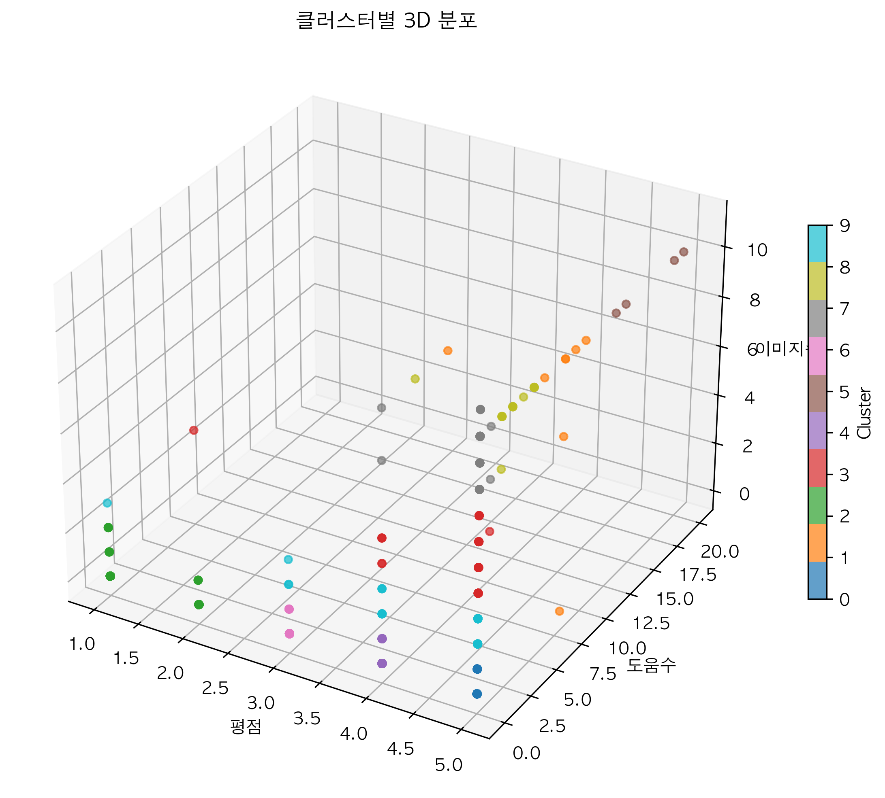
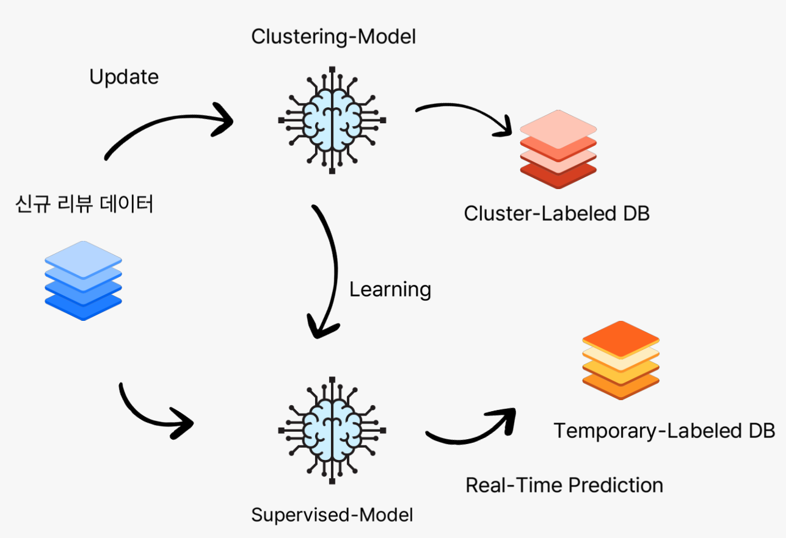

## 공지사항
### !주의!
- 프로그램 파일 저장 경로를 잘 수정해서 사용 바람

### 연락처
- **이메일**: leetry01@seoultech.ac.kr
- **문의**: 위 이메일로 연락 바랍니다

---

> **개발 환경**: Python 3.11.9, Jupyter Notebook, PyCharm

[구글 드라이브](https://drive.google.com/file/d/1CwuQ0cFHaFK7ku9dxF-2hUIIW8QGvaCC/view?usp=sharing)
- 위 링크를 통해 `data.zip` 을 다운로드 받은 후 프로젝트 루트 디렉토리에 풀어주시기 바랍니다.
- `data.zip` 내부의 `.csv` 파일 또한 압축 되어있습니다. 크롤링을 하지않고 데이터 분석을 원한다면 모두 풀어주셔야 합니다.
- 추가적으로 프로젝트 루트 디렉토리에 `env` 디렉토리를 만든 후 안에 proxy_list.txt 를 만들어 사용하는 프록시의 리스트를 넣어주셔서 크롤링이 가능합니다. (쿠팡 크롤링 IP 우회 전략)
- `env` 디렉토리와 `data` 디렉토리는 `.gitignore` 지정 바랍니다
---
> 쿠팡 리뷰 크롤링과 관련해서 문의가 있을 경우 다음 이메일로 연락 바랍니다.
> 
>leetry01@seoultech.ac.kr
---
## [2025SP] 데이터 마이닝 : 쿠팡 리뷰 클러스터링 기반 고객 분류 및 머신러닝 아키텍처 제안


### 팀원

산업공학과 산업정보시스템 전공
- 서민기
- 이강재
- 이상혁
- 정이주
---
### 1. 주제 배경 및 필요성
#### 리뷰 기반 고객 분류
- 기존 쿠팡에서는 키워드 기반 광고 집행 상품을 셀러들에게 팔고 있음
- 신규 광고 상품으로 리뷰 기반 클러스털ㅇ을 통한 타겟팅 광고 상품을 통해 광고주들의 경제적 효익 증가를 목표

#### 빈박스 리뷰 등 악성 리뷰 방지 효과
- 리뷰의 신뢰성을 저해하는 빈박스 리뷰 등의 악성 리뷰 구매 저해 효과를 기대
- 리뷰 기반 고객 타켓팅 광고 캠페인을 통해 매출 뿐만이 아닌 리뷰도 획득하는 건전한 시스템 구축

---
### 2. 분석 목적
#### 고객 분류를 통한 마케팅 전략 수립
- 리뷰 데이터의 EDA를 통한 데이터 탐색 실시
- EDA 기반 데이터 전처리 전략 수립 (Feature Engineering)
- 클러스터링을 통한 고객 분류

#### 머신러닝 기반 자동화 고객 분류 아키텍처 제안
- 데이터베이스와 지도학습+비지도학습 모델의 협력을 통해 리뷰 기반 타겟팅 광고 상품 판매
---
### 3. 데이터 획득 및 분석
#### 데이터 획득 방법
- 쿠팡 브랜드 상품 리스트 크롤링
  - 홈플래닛(전자제품)
  - 곰곰(식품)
- 상품별 리뷰 크롤링
  - 리뷰별 이미지수, 도움수, 별점, 텍스트(헤드-본문) 크롤링 진행
  - 약 16만 개의 데이터 수집
#### Feature Engineering
- 텍스트 데이터의 경우 군산대학교(KNU) 한국어 감정언어 말뭉치 데이터를 사용
- 배송, 분노, 가격, 추천, 재구매 등의 말뭉치를 직접 구축하여 feature 추출
#### EDA 결과 complete-text / non-text 로 구분하여 클러스터링 진행 결정
- non-text 그룹의 feature
  - 평점
  - 도움수
  - 이미지수
- complete-text 그룹의 feature
  - 도움수
  - 이미지수
  - 헤드라인 존재
  - 리뷰내용 존재
  - full_text_length
  - emoticon_count
  - sentiment_positive
  - sentiment_negative
  - sentiment_neutral
  - repurchase_mention
  - delivery_mention
  - quality_mention
  - recommend_mention
  - not_recommend_mention
  - emphasis_count
  - anger_mention
  - price_mention
---
### 4. 분석 결과

#### 선택 모델 지표
| 클러스터링 유형 | 최적 알고리즘 | 클러스터 수 | 실루엣 스코어 |
|----------------|---------------|--------|---------|
| 비텍스트 리뷰 | K-Means | 10개    | 0.98    |
| 텍스트 리뷰 | K-Means | 8개     | 0.529   |

#### non-text 분석
- k-means clustering (k=10)
- 클러스터와 중심점을 시각화하여 분석을 진행했습니다. 
- 모델 선정 기준으로 DBSCAN과 Agglomerative Clustering 모델의 정우 너무 많거나 너무 적은 클러스터로 묶이기 때문에 실용성이 떨어진다고 판단
- K-means-clustering 모델의 경우 k=10일 때 실루엣 스코어가 최대치 (0.98)로 나와 분석을 진행
#### 클러스터 해석

<단순 별점 리뷰어 그룹>
- 클러스터 0 (50,126개): 단순 5점 리뷰어 - 별점 5점
- 클러스터 2 (1,230개): 불만족 리뷰어 - 별점 1.53점
- 클러스터 4 (6,517개): 만족 리뷰어 - 별점 4점
- 클러스터 6 (2,168개): 중간 리뷰어 - 별점 3점

<소수 클러스터 그룹>
- 클러스터 5 (4개): 파워 리뷰어 - 5점 + 최고 도움수(16.5) + 많은 이미지
- 클러스터 1 (8개): 활발한 만족 리뷰어 - 높은 평점 + 도움수 + 이미지
- 클러스터 8 (17개): 상세 만족 리뷰어 - 높은 평점 + 이미지 + 도움수
- 클러스터 3 (71개): 이미지 첨부 만족 리뷰어 - 높은 평점 + 이미지
- 클러스터 9 (77개): 소량 이미지 첨부 만족 리뷰어 - 높은 평점 + 적은 이미지

#### complete-text 분석
**K-means Clustering (k=8) 및 DBSCAN Clustering 분석**
- 텍스트 리뷰 데이터에 대해 K-means와 DBSCAN 클러스터링을 수행하고 Silhouette Score를 이용한 최적 클러스터 수를 결정했습니다.

t-SNE 3D Clustering 시각화
- 전체 데이터셋과 샘플 데이터셋에 대한 t-SNE 3차원 시각화를 통해 클러스터 분포를 확인했습니다.

차원 축소 및 클러스터링 분석
- 차원의 저주를 피하기 위해 PCA(dim=3)로 차원을 축소한 후 클러스터링을 진행하여 k=8일 때 실루엣 점수 0.529로 가장 높은 값을 확인했습니다.

#### 클러스터 해석


클러스터별 특성 분석
- 불만족-조용(0): 15.9% - 평점 4.03 (가장 낮음), 부정적 17.8%, 중립 82.2%, 짧은 리뷰 (147자), 낮은 추천율 (18.8%) & 재구매율 (8.9%)
- 엄밀브랜드 앰버서더(1): 평점 4.96, 긍정 100%, 가장 긴 리뷰 (855자), 최고 재구매율 (44.4%), 강조표현 8.4개 (평균적)
- 충성만족 고객(2): 16% - 평점 4.95, 긍정 100%, 높은 추천율 (75.2%), 긴 리뷰 (731자), 재구매율 38.3%
- 실용주의(3): 5.5% - 평점 4.87, 중립 98.8%, 상세 분석형 리뷰 (851자), 높은 배송 언급 (62.0%)
- 약간-부정적(4): 5.8% - 평점 4.61, 부정적성 4.1% (두 번째로 높음), 낮은 추천율 (37.5%), 짧은 리뷰 (290자)
- 신중 분석(5): 23% - 평점 4.77, 중립 99.3%, 긴 분석형 리뷰 (700자), 배송 관심 높음 (55.8%)
- 조용-만족(6): 23% - 평점 4.84, 긍정 100%, 짧은 리뷰 (153자), 낮은 재구매율 (12.0%)
- 적극-추천(7): 11.3% - 평점 4.90, 긍정 100%, 높은 추천율 (54.2%), 중간 길이 리뷰 (277자)

---
### 5. 한계점 및 개선방안

#### 한계점
- 크롤링으로 인한 데이터의 흠결: 에러 처리 미숙/크롤링 차단 우회 실패/샘플링 편향 등
- 학습 데이터 전처리 방식의 한계: 자연어 처리 방법
- 사용자 기반 리뷰 데이터 확보 불가: 내부 데이터 접근 불가
#### 개선방안 / 추후 연구 진행 방안
- 자연어에서 feature를 뽑아내는 방법론 개선
- 단순 키워드 카운팅이 아닌 AI를 도입하여 context 기반 텍스트 분석
---
### 최종 제안 아키텍처

---
출처

- [오늘 아침 신문] '빈박스' 리뷰를 아시나요..건당 500원 가져 후기 판친다 (2025.01.31/뉴스투데이/MBC):
- https://www.youtube.com/watch?v=QTGFvVHqDdk
- 쿠팡 브랜드 (홈플래닛/곰곰):
- https://www.coupang.com/np/products/brand-shop
- KNU 한국어 감성사전: 
- https://github.com/park1200656/KnuSentiLex
---
>본 프로젝트는 데이터마이닝 수업의 일환으로 진행된 쿠팡 리뷰 클러스터링 기반 고객 분류 및 머신러닝 아키텍처 제안 연구입니다.

---

## 빠른 시작

### 환경 요구사항
```bash
# Python 버전
Python 3.11.9 - 3.13 (개발 환경: 3.11.9)

# 필수 시스템 사양
- RAM: 24GB 이상 권장 (개발 환경)
- 저장공간: 5GB 이상
- 네트워크: 안정적인 인터넷 연결 (크롤링용)
```

### 즉시 실행 (분석만 진행하는 경우) / bash 실행
```bash
# 1. 저장소 클론
git clone https://github.com/SEOULTECH-DataMining-2025SP-Team4/coupang-review-clustering-analysis.git
cd coupang-review-clustering

# 2. 가상환경 생성 및 활성화
python -m venv venv
source venv/bin/activate  # Windows: venv\Scripts\activate

# 3. 패키지 설치
pip install -r requirements.txt

# 4. 데이터 다운로드 (Google Drive) - 위 공지사항 참고
# data.zip을 프로젝트 루트에 압축 해제

# 5. 데이터 전처리 및 분석 실행 (.ipynb 주피터 노트북 파일을 이용하는 것을 권장)
python preprocessor.py
python EDA_review_data.py
python Clustering_non_text_review.py
python Clustering_complete_text_review.py
```

### 전체 파이프라인 (크롤링 포함)
```bash
# 1. 프록시 설정 (선택사항) - 쿠팡 크롤링 시 필요
mkdir env
# env/proxy_list.txt 파일 생성 후 프록시 정보 입력
# 형식: ip:port:username:password

# 2. 제품 URL 수집
python crawler_coupang_brand_product.py

# 3. 리뷰 데이터 크롤링
python crawler_coupang_review.py

# 4. 분석 파이프라인 실행
python preprocessor.py
python EDA_review_data.py
python Clustering_non_text_review.py
python Clustering_complete_text_review.py
```

## 프로젝트 구조

```
coupang-review-clustering/
├── README.md                              # 프로젝트 가이드
├── requirements.txt                       # 패키지 의존성
├── .gitignore                            # Git 무시 파일
│
├── data/                                 # 데이터 디렉토리 (Git 제외)
│   ├── Coupang-reviews-homeplanet/      # 전처리된 리뷰 데이터
│   │   ├── review_data.csv              # 전체 리뷰 데이터
│   │   ├── review_data_complete_text.csv # 텍스트 포함 리뷰
│   │   ├── review_data_non_text.csv     # 텍스트 없는 리뷰
│   │   └── *.csv                        # 클러스터링 결과 파일들
│   ├── 홈플래닛_products_dedup_first.json # 제품 URL 리스트
│   └── SentiWord_info.json              # 감정 분석용 사전
│
├── env/                                  # 환경 설정 (Git 제외)
│   └── proxy_list.txt                   # 프록시 서버 목록
│
├── img/                                  # 생성된 시각화 이미지
│   ├── *.gif                           # 3D 시각화 애니메이션
│   └── *.png                           # EDA 및 시각화 분석 차트
│
│
├── 크롤링 모듈                             # 데이터 수집
│   ├── crawler_coupang_review.py        # 리뷰 크롤링 (메인)
│   └── crawler_coupang_brand_product.py  # 상품 URL 수집          
│
├── 전처리 및 EDA                          # 데이터 분석
│   ├── preprocessor.ipynb               # 데이터 전처리 (Jupyter)
│   ├── preprocessor.py                  # 데이터 전처리 (스크립트)
│   ├── EDA_review_data.py               # 탐색적 데이터 분석
│   └── EDA_review_data.ipynb
│               
└── 클러스터링 분석                         # 머신러닝 모델
    ├── Clustering_non_text_review.py    # 논-텍스트 데이터 클러스터링
    ├── Clustering_complete_text_review.py # 텍스트 데이터 클러스터링
    ├── Clustering_non_text_review.ipynb    
    └── Clustering_complete_text_review.ipynb 
```

### 데이터 규모
```
전체 리뷰 수: 160,856개
├── 텍스트 포함 리뷰: 100,582개 (62.5%)
└── 평점만 리뷰: 60,274개 (37.5%)

리뷰 구성요소:
├── 기본 정보: 상품명, 구매자명, 작성일자
├── 평가 정보: 평점(1-5), 도움수, 이미지수
└── 텍스트 정보: 헤드라인, 리뷰내용
```


## 기술적 구현

### 핵심 기술 스택
```python
# 웹 크롤링
selenium==4.33.0          # 동적 페이지 처리
beautifulsoup4==4.13.4    # HTML 파싱
requests==2.32.3          # HTTP 통신

# 데이터 처리
pandas==2.2.3             # 데이터 핸들링
numpy==2.2.6              # 수치 연산

# 머신러닝
scikit-learn              # 클러스터링 알고리즘
matplotlib==3.10.3       # 시각화
seaborn                   # 통계 시각화 (색)

# 자연어 처리
emoji                     # 이모티콘 처리
konlpy                    # 한국어 토큰화 
```

## 재현 가이드

### 단계별 실행

#### 1단계: 환경 설정
```bash
# Python 버전 확인 (3.11.9 권장/3.13 런타임 환경 테스트 완료이나 3.11.9 환경에서 개발)
python --version

# 가상환경 생성 (conda 혹은 .venv 환경 실행 권장)
python -m venv coupang_analysis
source coupang_analysis/bin/activate

# 패키지 설치 (2025.6.6. 기준 패키지 버전)
pip install -r requirements.txt
```

#### 2단계: 데이터 전처리
```bash
# Jupyter 노트북으로 실행 (권장)
jupyter notebook preprocessor.ipynb

# 또는 Python 스크립트로 실행
python preprocessor.py
```

#### 3단계: 탐색적 데이터 분석
```bash
python EDA_review_data.py
# 출력: img/ 폴더에 시각화 결과 저장
```

#### 4단계: 클러스터링 분석
```bash
# 비텍스트 리뷰 클러스터링
python Clustering_non_text_review.py

# 텍스트 리뷰 클러스터링 (시간 소요: 약 30-60분)
python Clustering_complete_text_review.py
```


### 결과 파일
```
실행 완료 후 생성되는 파일들:
├── data/Coupang-reviews-homeplanet/
│   ├── review_data_complete_text_preprocessed.csv
│   ├── cluster_results_kmeans.csv
│   ├── cluster_results_dbscan.csv
│   └── sentiment_review_data.csv
├── img/
│   ├── cluster_*.png        # 클러스터링 시각화
│   ├── *.gif               # 3D 회전 애니메이션
│   └── *.png               # EDA 차트
└── logs/
    └── *.log               # 실행 로그
```

---
## 문제 해결 가이드

### 자주 발생하는 오류

#### 1. 메모리 부족 오류
- 특히 시각화(t-SNE, PCA) 혹은 클러스터링 알고리즘을 실행할 때 자주 발생
- 데이터 샘플링을 통해 데이터 수를 줄인 후 진행
```python
# 문제: MemoryError during clustering
# 해결: 샘플링 처리
df_sample = df.sample(n=10000, random_state=42)
```

#### 2. 한글 폰트 오류
```python
# 문제: matplotlib 한글 깨짐
# 해결: 폰트 설정
plt.rcParams['font.family'] = 'AppleGothic'  # macOS
plt.rcParams['font.family'] = 'Malgun Gothic'  # Windows
```
---
